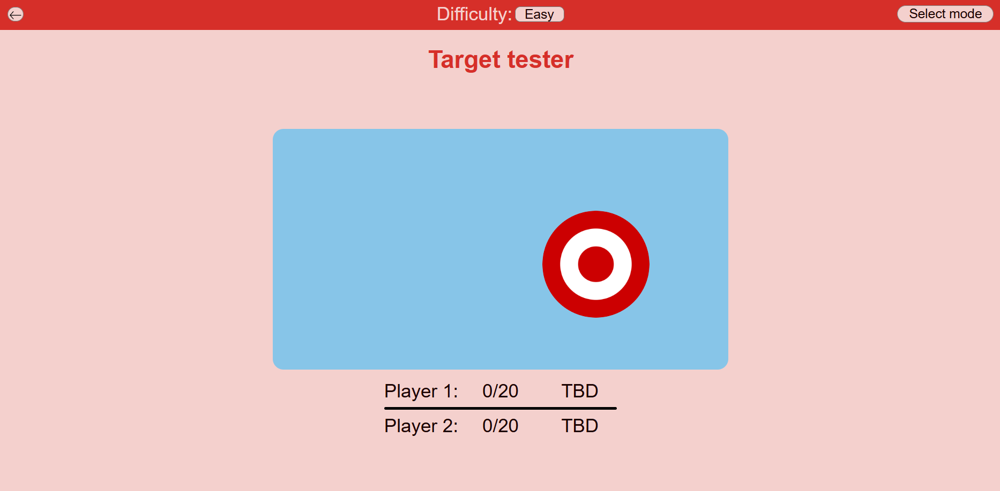
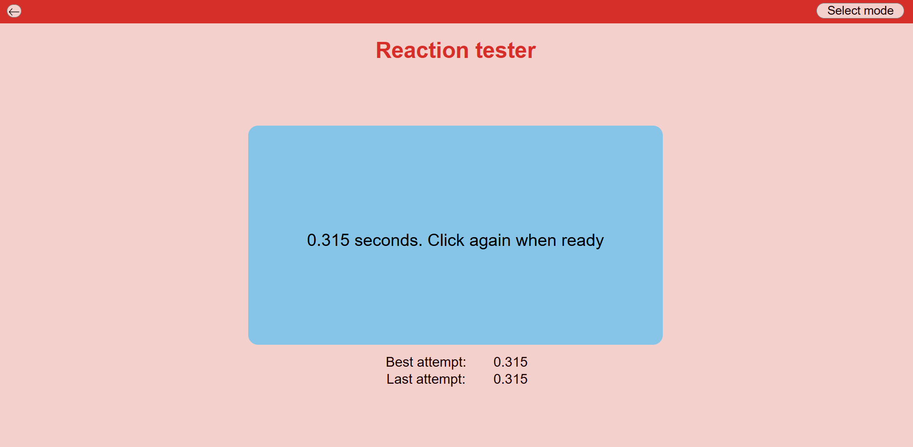
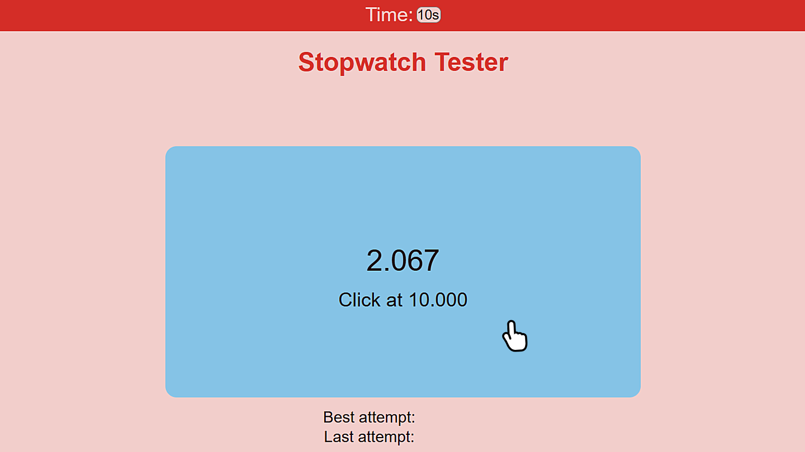
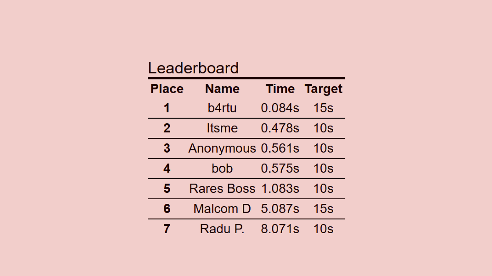

# reaction-tester
A full-stack web application that tests your reaction time through various minigames and stores your best attempts in a leaderboard.



You can try a demo of the webpage for yourself [here](https://pampu-rares.github.io/reaction-tester/). It does not include the leaderboards, which require NodeJs.

## Getting Started

### Prerequisites

This project requires Node.js installed on your system.
- If you do not have Node.js installed, you can install it from [here](https://nodejs.org/en/download);

### Installation

1. Paste this line into your terminal:

```shell
git  clone  https://github.com/Pampu-Rares/reaction-tester.git
```

2. Create a `.env` file in the root directory and write a value for the `PORT` (the project defaults to port 2020 if you skip this step)

```env
PORT=5050 # enter your desired port number
```

3. Open a terminal in the root repository and write:

```shell
npm run dev
```

4. Open a tab in your browser to localhost:5050 or the port number you have written in the `.env` file.

 - You can delete the `src/database/leaderboards.sqlite` file if you want to create a fresh database with no previous entries

## Usage

### Main Page

The main page displays a list of all of the available minigames. Currently, there are three of them.

- Each one offers the option for both 1-player and 2-player


### Target Tester Minigame

This minigame tests your ability to shoot a number 20 targets as fast as you can.

- ⭐It has three difficulties: Easy, Medium and Hard
Choose the desired one or challenge yourself by making the target smaller


### Reaction Time Minigame

This is the best and most straightforward way to test your reaction time.
All you have to do is click in the blue rectangle and follow the written instructions.

- 💡Pro tip: You can also press the Spacebar instead of clicking the blue area



### Stopwatch Tester Minigame

This minigame challenges your internal clock. Select a time interval and, after 5 seconds, the on-screen timer disappears. Click stop when you think the time is up. 

- 💡Pro tip: You can also press the Spacebar instead of clicking the blue area
- ⌚You can select between 10, 15 and 20 seconds



### Leaderboards

Each minigame has a leaderboard at the bottom of the page. It will show the top 20 best attempts. A user can only enter one attempt per session when prompted(for every minigame), or update their session attempt



## License

Distributed under the MIT License. See `LICENSE` for more information

## Contact
For improvements or suggestions you can contact me here:
Pampu Rares - [rarespampu@gmail.com](mailto:rarespampu@gmail.com)